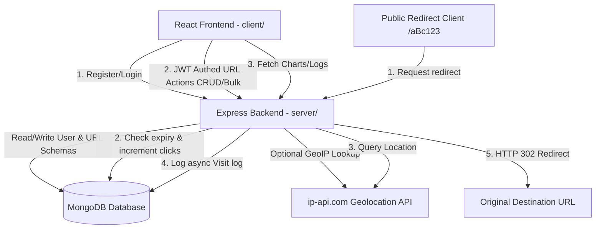

# Architecture Documentation - URL Shortener Pro

This document outlines the software architecture, data schemas, security strategies, and request workflows for the **URL Shortener Pro** application.

---

## 1. System Architecture Diagram



---

## 2. Request Workflows

### URL Shortening Flow (Authenticated)
1. **Request**: The client submits a destination URL, optional custom alias, and optional expiration date via `POST /api/urls`.
2. **Validation**: The backend validates the destination URL format and verifies if the custom alias is unique.
3. **Short Code Generation**: If no custom alias is provided, a secure 6-character random alphanumeric code is generated.
4. **QR Code Utility**: The backend generates a high-resolution base64 PNG data-url representing the short link.
5. **Database persistence**: The details are saved to the `urls` collection in MongoDB.

### Visitor Redirection & Analytics Flow
1. **Request**: A visitor accesses a short URL, e.g., `GET /myportfolio`.
2. **Fetch URL Details**: The server queries the database for the matching shortCode or customAlias.
3. **Expiration check**: If an expiration date is present and has passed, the server performs a 302 redirect to the client's `/expired` route.
4. **Incremental updates**: The server executes an atomic database operation to increment the `clickCount` by 1.
5. **Response Redirect**: The server responds with `HTTP 302 Redirect` to the original long destination URL immediately so the redirection feels instant.
6. **Non-blocking logging (Background)**:
   * The server extracts the visitor's IP address and User-Agent.
   * Device classification (Desktop, Mobile, Tablet) and browser name are parsed.
   * If the IP is a loopback/local address, a simulated location is selected. If it is public, a background query is executed to `ip-api.com`.
   * A new record is added to the `visits` collection.

---

## 3. Database Schema Overview

```
User Collection
├── name (String, required)
├── email (String, required, unique, validated index)
├── password (String, required, hashed with Bcrypt)
└── createdAt (Date)

URL Collection
├── userId (ObjectId, ref: 'User', required)
├── originalUrl (String, required)
├── shortCode (String, required, unique index)
├── customAlias (String, unique sparse index)
├── qrCode (String, base64 data url)
├── clickCount (Number, default 0)
├── expiryDate (Date, optional)
└── createdAt (Date)

Visit Collection
├── shortCode (String, required, indexed)
├── timestamp (Date, default Date.now)
├── ipAddress (String)
├── browser (String)
├── device (String)
├── country (String)
└── city (String)
```

---

## 4. Security Framework

* **Rate Limiting**: Protects APIs against brute-force/DDoS queries using `express-rate-limit`.
* **Helmet Middleware**: Configures HTTP headers to protect against clickjacking, sniff attacks, and cross-site scripting.
* **MongoDB Injection Protection**: Utilizes `express-mongo-sanitize` to purge query inputs of operator keys (like `$`, `.`).
* **Cross-Site Scripting (XSS)**: Incorporates `xss-clean` to filter incoming query data and parameters.
* **JWT Authentication**: Validates and restricts URL actions and analytics to the link owners.
